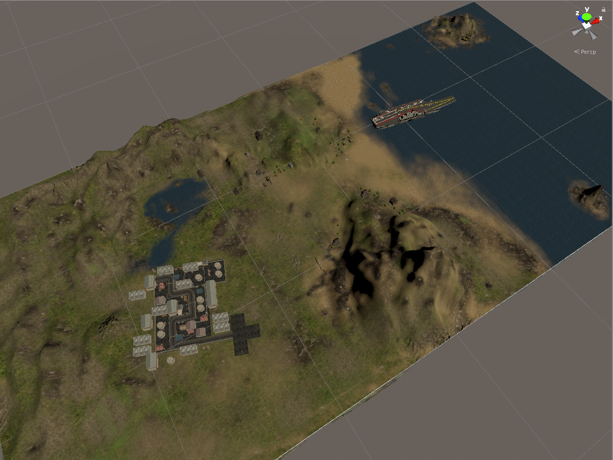
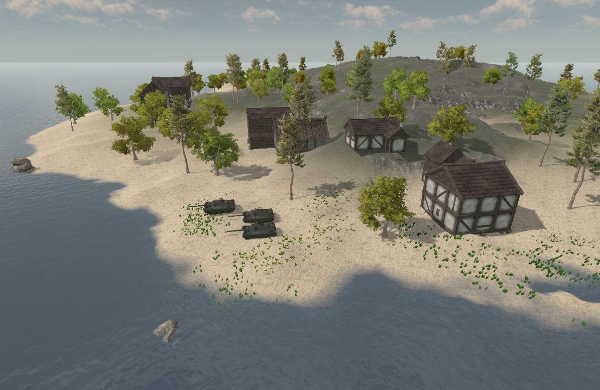
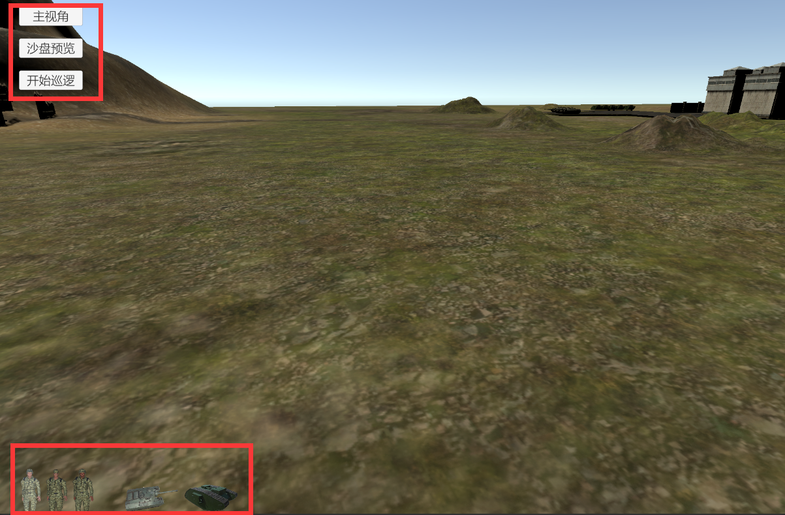
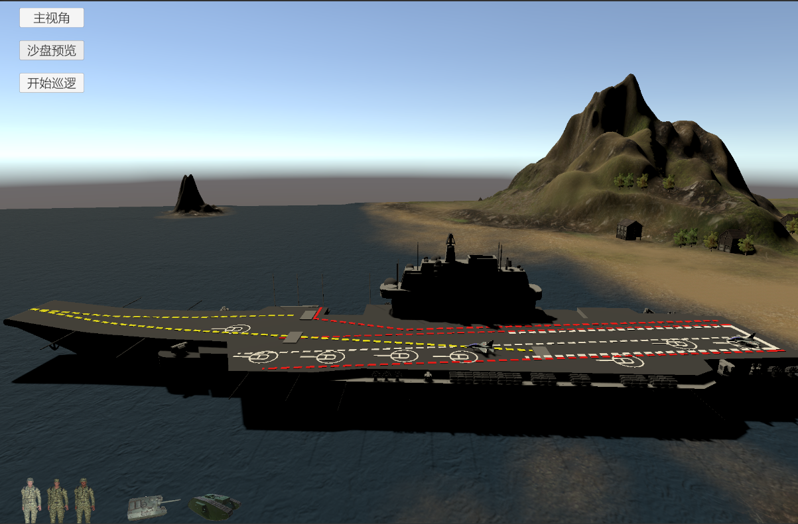
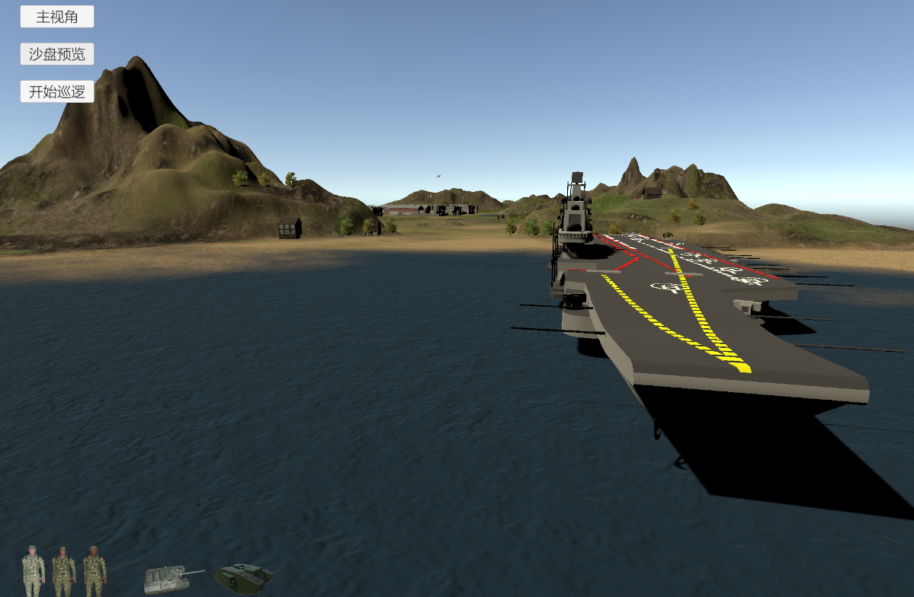
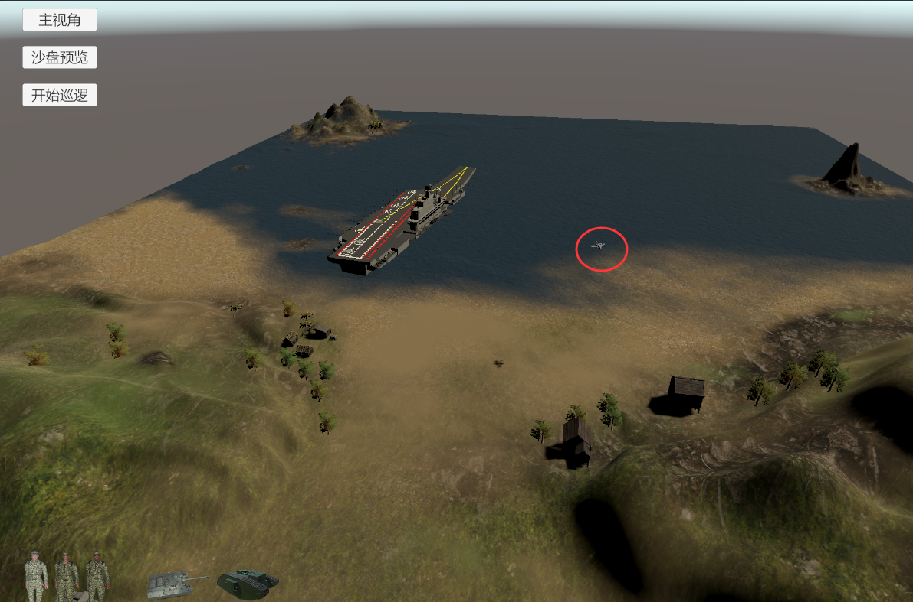
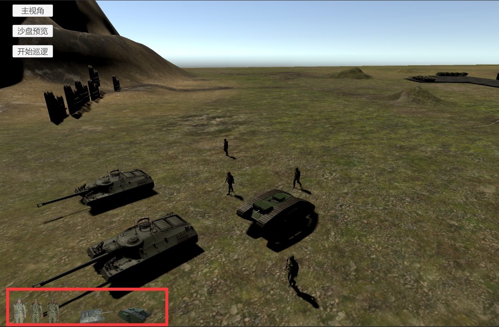
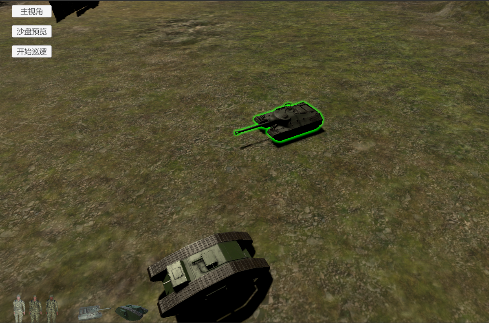
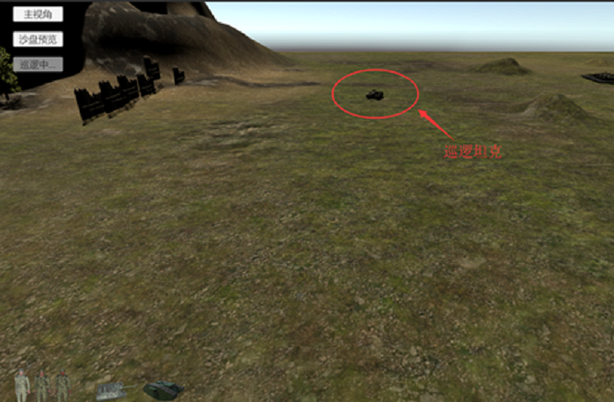
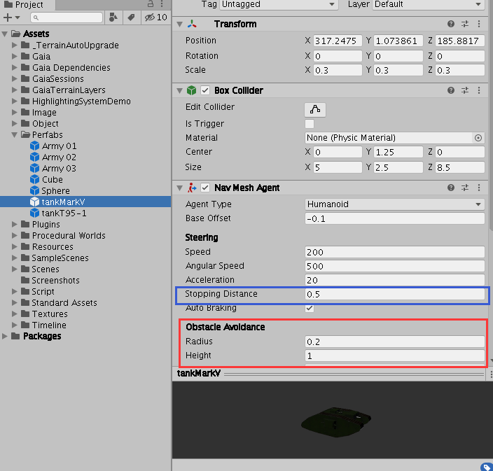

# **基于Unity3D引擎开发的交互式沙盘游戏**
## **简介**
本项目为在Unity3D引擎上开发的一款可交互的沙盘游戏。利用Unity3D自带的地图制作功能和Gaia插件，通过导入兵棋、房屋、树木等模型制作了颇具真实感的三维地图；制作游戏交互菜单按钮和可按钮触发的过场动画；通过编写C#脚本，开发鼠标和键盘交互功能，玩家可转换不同的视角观摩沙盘，以飞机第一人称视角在沙盘中漫游，以上帝视角以鼠标点击和拖拽的方式添加兵棋单位、自由调动兵棋，通过输入脚本自定义兵棋移动轨迹。该项目分别制作了“SampleScene”和“GaiaScene”两个不同的地图，玩家可通过键盘按键按照自己的喜好切换游戏场景。
## **地图概览**
场景一（SampleScene）：

场景二（GaiaScene）：

## **游戏玩法说明**

### **运行Game**

本项目已经生成了可在win10系统上双击运行的exe文件： `Build_files/SandPlay.exe` ，默认分辨率为1440x960。

以下将以Unity3D工程的视角对游戏玩法进行说明。若直接运行 `SandPlay.exe` 文件，相关的玩法操作与下述相同。

请用Unity 2019.3.8f1打开工程，在“Project”视窗中，目录Assets->Scenes下含有两个Unity Scene文件，分别为“SampleScene”和“GaiaScene”，这两个场景即为本组所开发的两个游戏场景。双击“SampleScene”，点击运行按钮，得到Game画面如图。需要将左上角屏幕分辨率调至1440 x 960，保证能看到整个画面左上方的三个Button按钮和左下角的五个图片按钮。

### **多视角观摩沙盘**

* 默认视角即为“主视角”，也即“上帝观察视角”

  * `滚动鼠标滚轮`：远近拉伸视角；
  * `长按鼠标右键并拖动鼠标`：控制视角方向（包括横向旋转和纵向俯仰）；
  * `长按鼠标中键并拖动鼠标`：平移视角；
* “飞行员观察视角”
  * `点击【沙盘预览】按钮`：视角会切换到航空母舰的侧面。此后会自动播放一段飞机从航母上起飞的过场动画；动画播放完毕后，视角自动转换到“飞行员观察视角”。此后可通过鼠标和键盘自由掌控飞机的飞行，来游览整个地图:
    * `移动鼠标`：控制飞行方向；
    * `键盘W/S`：控制飞机前进和后退；
    * `键盘A/D`：控制飞机左右移动；
    * `键盘Z/X`：控制飞机上下的升降；
  * 游览完毕后，若`点击【主视角】按钮`：视角会切换回航空母舰的侧面。此后会自动播放一段飞机降落的过场动画；动画播放完毕后，视角自动转换的“主视角”。 

  播放起飞动画：

  

  飞行员观察视角：

  

### **交互式路径动画**

运行Game后，通过键鼠将“主视角”调整到合适的观察位置和观察角度，就可以看见有一架飞机（在“Hierarchy”视窗下 的SampleScene中，对应的GameObject为“feiji3”），自动的按照预定的轨迹和姿态角进行飞行。飞行一段时间之后会停止。在 “Project”视窗中，目录Assets->Resources下的 FlyInput.txt 即为定义“feiji3”的飞行路径和姿态角的文件。输入信息需要写成规范的格式：每行代表一个采样点，含有六个数字——前三个数字是飞机在该采样点的位置x、y、z坐标，后三个数字是该采样点飞机的欧拉角，顺序与“feiji3”的Transform组件中的Rotation属性相对应，每个数字均用空格隔开。可输入任意多行。

飞机按照预定的轨迹和姿态飞行：

### **添加兵棋单位，切换场景**

在 “主视角”下，`鼠标左键点击左下角`的`兵棋单位图片按钮`，并`拖动`到场景中某一位置，松开鼠标左键，即可在场景中任何位置放置兵棋单位。可放置的兵棋单位包含三种类型的士兵和两种类型的坦克。
在任何时候`按下空格键`，游戏场景会在“SampleScene”和“GaiaScene”之间进行切换。在“GaiaScene”下，同样可以通过键鼠完成视角的平移、俯仰、旋转和远近拉伸，操作方式跟“SampleScene”相同。

放置兵棋单位：

“GaiaScene”画面：

### **兵棋单位的控制**

在“主视角”下，添加兵棋单位后，利用鼠标可控制这些兵棋单位的移动。
* `鼠标左键点击`某兵棋单位：该兵棋单位会高亮显示，表示已被选中；
* `鼠标左键重复点击`某已被选中的兵棋单位：该兵棋单位会被取消选中，高亮消失；
* `按住Ctrl键，鼠标左键点击`某些兵棋单位：可完成多个兵棋单位的选中；
* 选中兵棋之后，`鼠标左键点击`场景中的任意位置，所有高亮的兵棋单位以自己的速度会移动到该位置。
* 若已选中某（些）兵棋单位，`鼠标左键点击`某任意兵棋单位，该兵棋单位会被选中，而之前选中的兵器单位都会被取消选中，即完成兵器单位选中的切换。

被选中的兵棋高亮显示：

### **坦克工厂**

* 运行Game，坦克工厂中的坦克会逐一自动开到预定的区域集合，排列成队。
* `鼠标左键点击【开始巡逻】按钮`，会从坦克工厂中开出一辆坦克，在“主视角”周围的区域绕圈巡逻，最后回到原始位置停下。巡逻过程中【开始巡逻】按钮会转变成不能点击的【巡逻中…】状态。

坦克工厂坦克列队:

坦克巡逻:

### **补充说明**

对兵棋群落进行控制时，有以下两个需要注意的方面：

* 因为兵棋单位的寻路是采用Unity自带的Navigation导航系统，转弯具有一定的滞后性，当点击移动物体频率过于频繁（比如上一个位置还没有移动就位，就点击了下一位置），会导致物体寻路混乱，重复多次寻路，出现来回徘徊的现象。因此建议控制时，请等待上一个点击的位置移动完毕之后，再进行下一位置的点击。
* 多选物体，点击某个位置，被选中的物体都会移动到该位置，因此会出现“穿模”的现象。可以通过设置“Obstacle Avoidance”属性，增大寻路碰撞盒，来避免穿模现象的发生。但这可能会导致新的问题产生：设置寻路碰撞盒意味着只能有一个兵器单位精确的到达指定的位置，由于Navigation导航系统的设定，其他兵棋单位会因为该位置被占据、无法到达而不断的进行寻路而徘徊、无法停止，为了让其他兵棋单位也停下来，就需要设置合适的“Stopping Distance”，当兵棋到达在以目标点为圆心，“Stopping Distance”为半径的区域后，就会停下来。但这会导致另一个问题：点选某物体，点击以该物体为圆心，“Stopping Distance”为半径的区域的某个位置，该物体会不动，对用户体验是一个较大的破坏。况且将“Stopping Distance”手动设置成一个多大的值也是较为困难的问题。因此本小组暂且将“Stopping Distance”和寻路碰撞盒设置得较小，即允许“穿模”现象的发生。

  “Obstacle Avoidance”和“Stopping Distance”的相关设置菜单：

  

* “GaiaScene”中的三辆坦克也可以使用与“SampleScene”相同的操作进行移动的控制，但存在一些小bug，点选某物体后，需要多点击一次场景位置，该物体才会移动；切换选中的物体，上一个被选中的物体会移动到下一个被选中物体的位置。我们采用和“SampleScene”同样的脚本和设置，而这些问题在“SampleScene”是不存在的。这些问题的察明寄希望于后续的工作。

* 每次使用左下角的兵棋单位图片按钮添加物体之前，请先将之前选中的物体（即高亮的物体）都取消选中，然后再点击兵棋单位图片按钮拖动添加实例，否则先前被选中的物体会响应鼠标点击事件而移动到兵棋单位图片按钮在场景中所处的位置，这可能不是用户所期望的。

